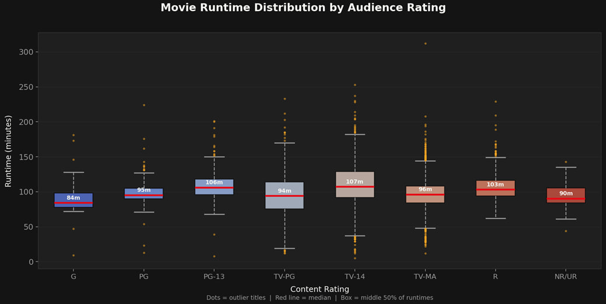
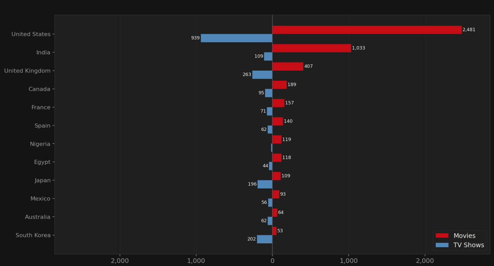
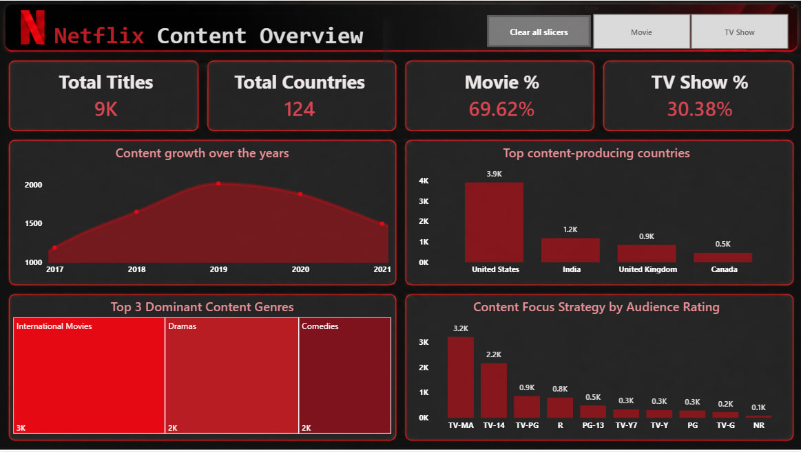
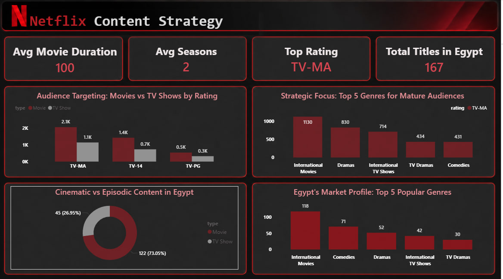

# Netflix in Numbers

## Table of Contents

- [Project Overview](#project-overview)
- [Problem Statement](#problem-statement)
- [Project Questions](#project-questions)
- [Data](#data)
- [Preprocessing](#preprocessing)
- [Exploratory Data Analysis](#exploratory-data-analysis)
- [Data Modeling](#data-modeling)
- [Power BI Dashboards](#power-bi-dashboards)
- [Key Findings](#key-findings)
- [Conclusion](#conclusion)
- [Project Files](#project-files)
- [Team Members](#team-members)
- [References](#references)

## Project Overview

**Netflix in Numbers** is a data analysis and Power BI project that examines Netflix's content library and platform trends. The analysis focuses on content type, production countries, genres, audience ratings, runtime, number of seasons, yearly publishing activity, and the Egyptian content market.

The project combines Python-based preprocessing and exploratory data analysis with Power Query transformations, data modeling, and two Power BI dashboard pages. The final result provides a historical view of Netflix's catalog up to 2021 and highlights patterns that can support content and market decisions.

## Problem Statement

Netflix needs to understand what type of content exists in its library, where that content comes from, and which audiences it targets. The main challenge is to identify the most common movies, TV shows, genres, countries, and age ratings so that content trends can be compared globally and in specific markets such as Egypt.

This project addresses that challenge by preparing the Netflix catalog for analysis and presenting the results through clear exploratory charts and interactive dashboard views.

## Project Questions

The analysis answers the following questions:

1. Does Netflix have more movies or TV shows?
2. How did the total number of titles added to Netflix change over the years?
3. Which countries produce the largest amount of Netflix content?
4. Which audience ratings are most common, and are they associated more with movies or TV shows?
5. What are the average movie runtimes and the typical number of TV show seasons?
6. What does the Netflix catalog look like in Egypt?
7. Which genres are most common in the Egyptian market?

## Data

The project uses the Netflix titles dataset, which contains information about titles available on Netflix, including:

| Field | Description |
| --- | --- |
| `show_id` | Unique identifier for each title. |
| `type` | Content type: Movie or TV Show. |
| `title` | Title name. |
| `director` | Director or directing information. |
| `cast` | Main cast members. |
| `country` | Country or countries associated with the title. |
| `date_added` | Date on which the title was added to Netflix. |
| `release_year` | Original release year. |
| `rating` | Audience rating. |
| `duration` | Movie runtime or number of TV show seasons. |
| `listed_in` | Genres and categories. |
| `description` | Short description of the title. |

The original dataset contains **8,807 titles**. The cleaned data is available in [`Data_cleaned.xlsx`](Data_cleaned.xlsx).

## Preprocessing

The preprocessing stage was performed in the notebooks located in [`Data_Preprocessing`](Data_Preprocessing). The workflow included checking data types, duplicated rows, unique titles, missing values, inconsistent fields, and incorrect values.

A considerable number of null values existed in the original data. Instead of leaving all of them unresolved, the missing values were investigated and replaced using information collected from websites. The title was used as a reference to find the appropriate information for the affected record. This approach was applied to fields such as directors, cast members, countries, dates added to Netflix, and content ratings.

The main preprocessing steps were:

- Checking the dataset structure and data types.
- Confirming that titles were unique and checking for duplicated records.
- Reviewing missing values in the main descriptive columns.
- Filling many missing director, cast, country, date, and rating values using information collected from websites.
- Correcting values that were stored in the wrong column, such as movie runtimes appearing in the rating column.
- Converting `date_added` to a consistent date format.
- Extracting the year from `date_added` for time-based analysis.
- Extracting numeric movie runtime values from the `duration` field.
- Separating movie duration from the number of TV show seasons.
- Splitting multi-value country and genre fields when required for analysis.

The final cleaned dataset was exported to Excel and used as the input for the EDA notebook and Power BI model.

## Exploratory Data Analysis

The exploratory analysis was performed with Python using pandas, NumPy, Matplotlib, and Seaborn. The analysis focused on runtime distribution, genre activity over time, and the countries producing the largest number of movies and TV shows.

### Movie Runtime by Rating

This boxplot compares movie runtime distributions across audience ratings. The red line in each box represents the median runtime, the box represents the middle 50% of observations, and the points represent outlier titles.

The chart helps compare the typical length of content intended for different audience groups and identify unusually short or long movies.

### Genre Volume by Year

The heatmap shows the number of titles added to Netflix for the most common genres between 2015 and 2021. It makes it easier to identify genres that expanded strongly during the period and years in which Netflix's publishing activity increased.

### Movies and TV Shows by Country

The diverging bar chart compares movies and TV shows across the top content-producing countries. Movies are displayed on one side and TV shows on the other side, allowing the difference between the two content types to be compared for each country.

The EDA results indicate a clear increase in Netflix content publishing, with the United States holding the leading position in global production. The analysis also highlights the importance of international movies and drama-related categories in the catalog.

## Data Modeling

After preprocessing, the data was prepared in Power Query before being used in Power BI. The model follows a star-schema approach so that the dashboard measures can be calculated consistently and filtered efficiently.

The preparation stage included standardizing columns, creating analysis fields such as `year_added`, separating content types, and preparing dimensions for title, date, country, genre, and rating analysis. This structure supports comparisons between movies and TV shows and allows the dashboard to analyze the catalog from multiple perspectives.

## Power BI Dashboards

The final Power BI report contains two dashboard pages: **Netflix Content Overview** and **Netflix Content Strategy**.

### Dashboard 1: Netflix Content Overview

The first page provides a general view of Netflix's catalog. It focuses on the scale of the library, the balance between movies and TV shows, production over time, leading countries, content ratings, and the most visible genres.

The overview page shows that Netflix's content publishing increased substantially over time. It also confirms the leading role of the United States in production and shows the strong presence of international movies and drama categories.

### Dashboard 2: Netflix Content Strategy

The second page focuses on strategic interpretation. It connects audience ratings, content types, genres, and country-level patterns to provide a more targeted view of Netflix's content strategy.

The strategy page highlights a strong focus on mature audiences, with **TV-MA** appearing as the dominant rating. International movies and dramas are important drivers of this pattern.

The Egypt-focused analysis shows that the local catalog is more strongly associated with cinematic content, especially international movies and comedy-related genres. This provides a specific market perspective in addition to the global analysis.

## Key Findings

### Content Growth and Production Countries

Netflix's content publishing activity escalated over the analyzed period. The United States was the leading content-producing country, while other countries contributed different balances of movies and TV shows.

### Content Type and Genre

Movies form a major part of the catalog, while TV shows provide a different structure through the number of seasons. International movies and drama categories are among the most common content groups in the dataset.

### Target Audience

The catalog is primarily oriented toward mature audiences. The **TV-MA** rating is the most prominent audience category in the dashboard analysis, and it is strongly associated with the international movies and drama content that dominates the library.

### Egypt Spotlight

The Egyptian market is dominated by cinematic content rather than TV shows. International movies and comedy are among the most visible categories in the Egypt-focused analysis, indicating a preference for movie-based and entertainment-oriented content in this market.

## Conclusion

This project maps Netflix's content strategy up to 2021 and provides a historical baseline for evaluating future changes in the platform's catalog. The results show an expanding content library, a leading contribution from the United States, a strong presence of international movies and dramas, and a clear concentration of content aimed at mature audiences.

The Egypt spotlight adds a local perspective by showing that the Egyptian catalog is more movie-oriented and has a notable presence of international movies and comedy. Together, the EDA and Power BI dashboards provide a structured view of Netflix content distribution, audience targeting, and market differences.

## Project Files

| File or folder | Purpose |
| --- | --- |
| [`Data_Preprocessing/EDA.ipynb`](Data_Preprocessing/EDA.ipynb) | Python exploratory data analysis and chart generation. |
| [`Data_Preprocessing/netflix shows data cleaning (preprocessing).ipynb`](Data_Preprocessing/netflix%20shows%20data%20cleaning%20%28preprocessing%29.ipynb) | Data inspection, cleaning, and missing-value treatment. |
| [`Data_cleaned.xlsx`](Data_cleaned.xlsx) | Cleaned dataset used for analysis and modeling. |
| [`Project.pbix`](Project.pbix) | Power BI report containing the data model and dashboards. |
| [`images/`](images) | EDA and dashboard screenshots used in this README. |
| [`Netflix project presentation .pptx`](Netflix%20project%20presentation%20.pptx) | Project presentation explaining the analysis workflow and results. |

## Team Members

| Team member |
| --- |
| Yossef Haytham |
| Hamdy Osama |
| Asser Hanafy |
| Rahma Hosam |

